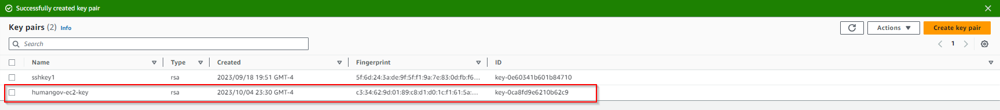

## Project title:

## HumanGov: Deployment Of A Reusable Saas Multi-tenant AWS Infrastructure Using Terraform Modules Securely Storing Terraform Configuration Files On AWS Code Commit.


## Project description:

In this project based on a real-world scenario, I designed and deployed a reusable, multi-tenant SaaS infrastructure on AWS using Terraform modules.

The infrastructure was based on AWS services such as EC2 instances, DynamoDB databases, and S3 buckets. To ensure the secure storage of Terraform configuration files, I used AWS CodeCommit… 


To implement this project, I adopted a methodology by breaking down the process into several steps which will make it easy to troubleshoot the following step

# step 1 
connect to the new AWS CodeCommit repository (humangov-infrastructure) to securely store Terraform configuration files 

# step 2 
Designing a Terraform module that creates and configures AWS resources such as EC2 instances, RDS databases, and S3 buckets for null; tenant SaaS applications

# step 3 
Implement AWS IAM roles and policies to provide secure access to the deployed resources

# step 4
Configure the Terraform backend to use an S3 bucket for storing the Terraform state files 

# step 5
Deploy the infrastructure using Terraform and test the setup to ensure it's working as expected. 

# step 6 
Document the process and provide instructions on how to reuse and customize the terraform module for different tenants 


by the end of this project, we will have a reusable, scalable, and secure SaaS multi-tenant infrastructure on AWS, leveraging the power of TErraform modules and the security of AWS codeCommit. This infrastructure will serve as a blueprint for future deployments, making it easier and more efficient for HumanGov to deploy and manage their SaaS applications in the cloud. 

To have a better experience I created a cloud9 environment to code the infrastructure, if you have challenges doing that check out my post on setting up cloud9 and linking it to AWS CodeCommit found here.

Let's dive into it. 

# Terraform Modules and AWS Code Commit - Implementation - | AWS

Move to the `human-gov-infrastructure` folder:

```
cd human-gov-infrastructure

```

Create a root directory folder to store Terraform files:

```
mkdir terraform

```

Create a new directory called `modules/aws_humangov_infrastructure` to hold the module files:

```
cd terraform
mkdir -p modules/aws_humangov_infrastructure

```

Inside the `modules/aws_humangov_infrastructure` directory, create the following empty files:

```
cd modules/aws_humangov_infrastructure
touch variables.tf main.tf outputs.tf

```

Edit the files accordingly:

**[variables.tf](http://variables.tf/)**

```
variable "state_name" {
   description = "The name of the US State"
}

```

**[main.tf](http://main.tf/)**

```
resource "aws_security_group" "state_ec2_sg" {
  name        = "humangov-${var.state_name}-ec2-sg"
  description = "Allow traffic on ports 22 and 80"

  ingress {
    from_port   = 22
    to_port     = 22
    protocol    = "tcp"
    cidr_blocks = ["0.0.0.0/0"]
  }

  ingress {
    from_port   = 80
    to_port     = 80
    protocol    = "tcp"
    cidr_blocks = ["0.0.0.0/0"]
  }

  tags = {
    Name = "humangov-${var.state_name}"
  }
}

resource "aws_instance" "state_ec2" {
  ami           = "ami-007855ac798b5175e"
  instance_type = "t2.micro"
  key_name = "humangov-ec2-key"
  vpc_security_group_ids = [aws_security_group.state_ec2_sg.id]

  tags = {
    Name = "humangov-${var.state_name}"
  }
}

resource "aws_dynamodb_table" "state_dynamodb" {
  name           = "humangov-${var.state_name}-dynamodb"
  billing_mode   = "PAY_PER_REQUEST"
  hash_key       = "id"

  attribute {
    name = "id"
    type = "S"
  }

  tags = {
    Name = "humangov-${var.state_name}"
  }
}

resource "random_string" "bucket_suffix" {
  length  = 4
  special = false
  upper = false
}

resource "aws_s3_bucket" "state_s3" {
  bucket = "humangov-${var.state_name}-s3-${random_string.bucket_suffix.result}"
 
  tags = {
    Name = "humangov-${var.state_name}"
  }
}

resource "aws_s3_bucket_acl" "example" {
    bucket = "humangov-${var.state_name}-s3-${random_string.bucket_suffix.result}"
    acl    = "private"
}


```

**[outputs.tf](http://outputs.tf/)**

```
output "state_ec2_public_dns" {
  value = aws_instance.state_ec2.public_dns
}

output "state_dynamodb_table" {
  value = aws_dynamodb_table.state_dynamodb.name
}

output "state_s3_bucket" {
  value = aws_s3_bucket.state_s3.bucket
}

```

In your root project directory, create a `main.tf` file that will consume the `modules/aws_humangov_infrastructure` module:

```
provider "aws" {
  region = "us-east-1"
}

module "aws_humangov_infrastructure" {
  source     = "./modules/aws_humangov_infrastructure"
  for_each   = toset(var.states)
  state_name = each.value
}

```

In your root project directory, create the file `variables.tf`:

```
variable "states" {
  description = "A list of state names"
  default = ["California","California","Denver"]
}

```

In your root project directory, create the file `outputs.tf`:

```
output "state_infrastructure_outputs" {
  value = {
    for state, infrastructure in module.aws_humangov_infrastructure :
    state => {
      ec2_public_dns   = infrastructure.state_ec2_public_dns
      dynamodb_table   = infrastructure.state_dynamodb_table
      s3_bucket        = infrastructure.state_s3_bucket
    }
  }
}

```

Create the SSH key `humangov-ec2-key` and upload the private key `humangov-ec2-key.pem` to Cloud9 (for saving purposes).


Now, initialize and apply the Terraform configuration:

```
terraform fmt
terraform init
terraform validate
terraform plan
terraform apply

```
let's verify our created resources the ec2 instances etc 


Create a new S3 bucket to store the Terraform state remotely. Replace `your-unique-state-bucket-name` with a unique bucket name:

```
aws s3api create-bucket --bucket humangov-terraform-state-x921 --region us-east-1

```


Note that the `backend.tf` configuration also specifies a DynamoDB table (`terraform-lock-table`) for state locking. State locking helps prevent concurrent modification of the state file, which can lead to corruption. As we want to use state locking, let's create the DynamoDB table manually:

```
aws dynamodb create-table \\
  --table-name humangov-terraform-state-lock-table \\
  --attribute-definitions AttributeName=LockID,AttributeType=S \\
  --key-schema AttributeName=LockID,KeyType=HASH \\
  --provisioned-throughput ReadCapacityUnits=5,WriteCapacityUnits=5 \\
  --provisioned-throughput ReadCapacityUnits=5,WriteCapacityUnits=5

```


In your root project directory, create a `backend.tf` file in your project directory:

```
touch backend.tf

```

Edit the `backend.tf` file with the following content. Replace `your-unique-state-bucket-name` with the name of the bucket you created in step 4:

```
terraform {
  backend "s3" {
    bucket         = "humangov-terraform-state-x921"
    key            = "terraform.tfstate"
    region         = "us-east-1"
    encrypt        = true
    dynamodb_table = "humangov-terraform-state-lock-table"
  }
}

```

Initialize Terraform:

```
terraform init

```

Apply the Terraform configuration:

```
terraform apply

```

Now, Terraform will store the state remotely in the specified S3 bucket. You can verify this by checking the contents of the S3 bucket using the AWS CLI or the AWS Management Console.


```
terraform destroy

```


Switch to Git Working Directory:

```
cd human-gov-infrastructure

```

Add a `.gitignore` file to your repository to exclude sensitive information and temporary files generated by Terraform from being tracked. Some common entries to include in your `.gitignore` file are:

```
.terraform/
*.tfstate
*.

tfstate.backup
*.tfvars
*.tfplan
*.tfr
*.tfstate.lock.info

```


Add Terraform files to the local git repository, commit, and push them to AWS CodeCommit:

```
git status


git add .
git status
git commit -m "AWS Infrastructure Terraform Configuration - first commit"
git push -u origin

```


Now destroy the infrastructure to avoid costs until the next module:

```
terraform destroy

```

Capture the `terraform destroy` evidence - after destroy.


Part 3 

Switch to Git Working Directory:

```
cd human-gov-infrastructure

```

Add a `.gitignore` file to your repository to exclude sensitive information and temporary files generated by Terraform from being tracked. Some common entries to include in your `.gitignore` file are:

```
.terraform/
*.tfstate
*.

tfstate.backup
*.tfvars
*.tfplan
*.tfr
*.tfstate.lock.info

```

Add Terraform files to the local git repository, commit, and push them to AWS CodeCommit:

```
git status
git add .
git status
git commit -m "AWS Infrastructure Terraform Configuration - first commit"
git push -u origin

```

